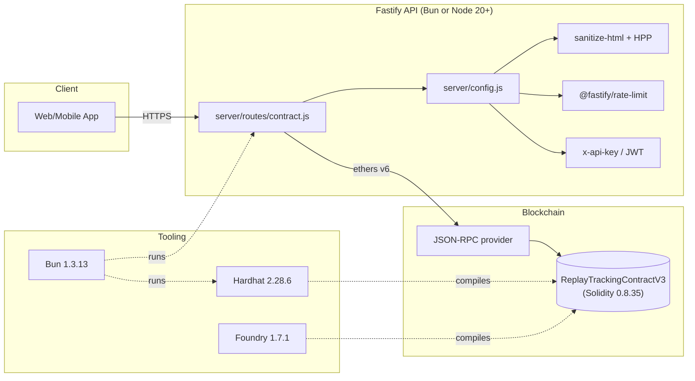

# ReplayTrackingContract

> Decentralized token market (DeFi) smart contract that tracks content-viewing
> records and rewards users with tokens. **v2.2.0 (2026-07-05)** — switched
> the primary package manager and runtime to **Bun 1.3.13** (Node 20+ remains
> the supported fallback). The contract itself is hardened with `nonReentrant`
>
> - `whenNotPaused` + custom errors, and ships with **32 passing contract
>   tests**.

---

## Table of contents

- [What this is](#what-this-is)
- [Quick start (5 minutes)](#quick-start-5-minutes)
- [Architecture](#architecture)
- [Toolchain](#toolchain)
- [Project layout](#project-layout)
- [Local development](#local-development)
- [Contract security model](#contract-security-model)
- [Server security model](#server-security-model)
- [Production deployment](#production-deployment)
- [CI / CD](#ci--cd)
- [Documentation index](#documentation-index)
- [Scripts reference](#scripts-reference)
- [Upgrading from v1](#upgrading-from-v1)
- [License](#license)

---

## What this is

`ReplayTrackingContractV3` is a Solidity contract that:

- Records who watched which asset on which day, and for how long.
- Computes per-user reward balances (consumer + content-owner) over time.
- Exposes a `pause` / `unpause` emergency stop.
- Gates all writes behind a role-based access control (`ADMIN_ROLE`).
- Rejects reentrancy, oversized batches, oversized strings, and invalid dates.

The companion Fastify API in `server/` reads from the contract over JSON-RPC
and exposes it over HTTPS, with a hardened middleware stack (CSP, CORS
allowlist, HPP, sanitize-html, constant-time API key compare, optional JWT).

### Runtime

| Primary        | Fallback | Status                                                       |
| -------------- | -------- | ------------------------------------------------------------ |
| **Bun 1.3.13** | Node 20+ | Both fully tested. Bun is faster; Node is more conservative. |

The whole toolchain is on the **latest stable** as of 2026-07-05:

| Tool                       | Version    | Notes                              |
| -------------------------- | ---------- | ---------------------------------- |
| **Solidity**               | **0.8.35** | EVM `osaka`                        |
| **Hardhat**                | **2.28.6** | 2.x line (not 3)                   |
| **OpenZeppelin Contracts** | **5.6.1**  | Single dep, v4 aliases removed     |
| **Ethers**                 | **6.17.0** | v6 (v7 not yet released)           |
| **Bun**                    | **1.3.13** | Primary package manager + runtime  |
| **Foundry**                | **1.7.1**  | `forge`, `cast`, `anvil`, `chisel` |
| **Ape (ApeWorx)**          | **0.8.50** | Python framework                   |
| **Brownie**                | **1.22.2** | Python, legacy (maintenance mode)  |
| **Truffle / Ganache**      | —          | NOT installed (archived Feb 2024)  |
| **Node**                   | **≥ 20**   | Fallback runtime                   |

---

## Quick start (5 minutes)

```bash
# 1. Install Bun (skip if you already have it)
curl -fsSL https://bun.sh/install | bash

# 2. Install dependencies
bun install                 # ~6s, 916 packages

# 3. Compile the Solidity contracts
bunx hardhat compile        # → "Compiled 19 Solidity files successfully"

# 4. Run the contract test suite (32 tests, all passing)
bunx hardhat test

# 5. Start a local EVM (pick one — DO NOT run both at the same time)
bunx hardhat node           # Hardhat's in-process node on :8545
# OR
anvil                       # Foundry's anvil on :8545

# 6. Deploy the contract to the local node
node scripts/deploy-contract-local.js
# → prints: "Contract deployed to: 0x..."
# → also: "To wire the API to this deployment, set in .env: CONTRACT_ADDRESS=0x..."

# 7. Wire up the API
cp .env.example .env
# Edit .env: set CONTRACT_ADDRESS to the value from step 6
# (The default anvil key is a public dev key — safe for local testing.)

# 8. Start the API (Bun or Node)
bun run index.js            # Bun
# OR
node index.js               # Node 20+
```

The API listens on `http://localhost:3000` by default. Health: `GET /health`. Docs: `docs/api/openapi.yaml`.

> **Not on Bun?** Replace `bun install` with `npm install`, `bunx` with `npx`. Every script has a `*:bun` variant in `package.json` for clarity.

---

## Architecture



The contract is the source of truth. The API is a thin read+write layer with
heavy hardening (CSP, CORS allowlist, HPP, rate limits, request IDs, structured
logging). The off-chain tooling (Hardhat, Forge, Bun) compiles + tests the
contract independently — the API never relies on the artifacts at runtime.

See [docs/ARCHITECTURE.md](docs/ARCHITECTURE.md) for the full diagram, request
lifecycle, and failure modes.

---

## Toolchain

### Required

| Tool                   | Install                                     | Version |
| ---------------------- | ------------------------------------------- | ------- |
| **Bun** (primary)      | `curl -fsSL https://bun.sh/install \| bash` | 1.3.13+ |
| **OR Node** (fallback) | `nvm use` (we ship `.nvmrc` with `20`)      | 20+     |
| **Foundry**            | `npm run foundry:install`                   | 1.7.1+  |

### Optional

| Tool                 | Install                                                 | Use                                        |
| -------------------- | ------------------------------------------------------- | ------------------------------------------ |
| **Ape (Python)**     | `npm run python:setup` then `source .venv/bin/activate` | Python contract tests                      |
| **Brownie (Python)** | `pipx install eth-brownie`                              | Legacy Python framework (maintenance mode) |
| **Docker**           | `brew install --cask docker`                            | Containerized deploys                      |

### NOT installed (and why)

- **Truffle** (`truffle` npm package): **archived by ConsenSys on Feb 26, 2024**.
  Last release 5.11.5 (Sep 2023). No Node 20+ support, no Solidity 0.8.20+
  support, no OZ v5 support, no security backports.
- **Ganache** (`ganache` npm package): **archived by ConsenSys on Feb 26, 2024**.
  Last release 7.9.0 (Jul 2023). Final EVM is `shanghai`.

  Use **Anvil** (Foundry) or **`bunx hardhat node`** instead — they speak the
  same JSON-RPC, are actively maintained, and support the latest EVM upgrades.

---

## Project layout

```
.
├── contracts/                            # Solidity sources
│   ├── ReplayLibrary.sol                 # Pure data + key encoder
│   ├── ReplayTrackingContractV2.sol      # V3 contract (filename kept for
│   │                                       the existing artifacts/ ABI path)
│   └── ReplayTrackingContractV3_flattened.sol  # Deprecated stub
├── scripts/
│   ├── deploy-contract-local.js          # Deploy to a local node
│   ├── deploy-contract-anvil.js          # Deploy to anvil specifically
│   ├── deploy-contract-prod.js           # Deploy to a remote chain
│   ├── deploy-contract-verify.js         # Deploy + auto-verify on Etherscan
│   ├── verify-compile.sh                 # bunx/npx hardhat compile with success marker
│   ├── health-check.js                   # Ping all RPC endpoints
│   ├── check-balance.js                  # Pre-flight deployer balance check
│   ├── check-all.sh                      # Full local CI gate (bun-aware)
│   ├── push-to-prod.sh                   # Push + deploy prep helper
│   └── python-setup.sh                   # Install the Python toolchain
├── server/
│   ├── abi.json                          # Auto-regenerated from the artifact
│   ├── config.js                         # Fastify middleware
│   └── routes/
│       └── contract.js                   # Fastify routes
├── tests/
│   ├── hardhat/
│   │   └── ReplayTracking.test.js        # 32 mocha contract tests
│   ├── endpoints.test.js                 # Vitest server endpoint tests
│   └── reports/                          # Report-generation scripts
├── .upgrade/                             # Upgrade working notes (kept in repo)
│   ├── SUMMARY.md                        # v1 → v2.0.0 migration log
│   ├── agent-1..10-*.md                  # per-agent v1 decisions
│   └── v2/                              # v2.0.0 → v2.1.0 (security pass)
│       ├── 00-master-plan.md            # 100 micro-tasks, 10 domains
│       ├── 01..10-*.md                  # per-domain decision files
│       └── SUMMARY.md                   # v2.1.0 final summary
├── .github/workflows/                    # CI / CD (Bun via oven-sh/setup-bun@v2)
│   ├── ci.yml                            # install → audit → lint → compile → test
│   └── audit.yml                         # weekly bun audit
├── docs/                                 # Long-form documentation
│   ├── ARCHITECTURE.md
│   ├── SECURITY.md
│   ├── RUNBOOK.md
│   ├── DEPLOYMENT.md
│   ├── PROD_DEPLOY.md                    # Step-by-step prod runbook
│   ├── CONTRIBUTING.md
│   ├── CHANGELOG.md
│   ├── ADR/                              # 4 architectural decision records
│   └── api/openapi.yaml                  # OpenAPI 3.0 spec
├── foundry.toml                          # Foundry config
├── remappings.txt                        # Foundry remappings
├── ape-config.yaml                       # Ape config
├── brownie-config.yaml                   # Brownie config (legacy)
├── pyproject.toml                        # Python project metadata
├── requirements.txt                      # Python deps
├── hardhat.config.js                     # Hardhat config
├── package.json                          # Bun/Node scripts + deps
├── bun.lock                              # Bun lockfile (primary)
└── .solhint.json                         # Solidity linter rules
```

---

## Local development

### 1. Install everything

```bash
# Install Bun (skip if you have it)
curl -fsSL https://bun.sh/install | bash

# Install Node deps (916 packages in ~6s)
bun install

# Install Foundry
npm run foundry:install

# Optional: Python tools
npm run python:setup && source .venv/bin/activate
```

### 2. Run the full local CI gate

```bash
bash scripts/check-all.sh
# ▶ install (bun install --frozen-lockfile)
# ▶ audit (non-fatal — most findings are in Hardhat transitive deps)
# ▶ solhint
# ▶ hardhat compile
# ▶ hardhat test
# ▶ forge build
# ▶ prettier --check
# ✅ All checks passed
```

The script auto-detects `bun` (preferred) or falls back to `npm` + `npx`.

### 3. Start a local EVM and deploy

```bash
# Terminal 1
anvil                     # OR: bunx hardhat node

# Terminal 2
node scripts/deploy-contract-local.js
# → Contract deployed to: 0x5FbDB2315678afecb367f032d93F642f64180aa3
```

### 4. Run the API

```bash
cp .env.example .env
# Edit .env: set CONTRACT_ADDRESS=0x5FbDB...  (from step 3)

# Bun (recommended)
bun run index.js
# OR Node
node index.js

curl http://localhost:3000/health    # → {"status":"ok","uptime":...}
```

### 5. Run the contract test suite

```bash
bunx hardhat test            # Bun
# OR
npx hardhat test             # Node 20+
# → 32 passing, 0 failing

# With gas reporting
REPORT_GAS=true bunx hardhat test

# With coverage
bunx hardhat coverage
```

### 6. Run the server test suite

```bash
bun test                     # Vitest (via bunx)
# OR
npm test                     # Vitest via npm scripts
```

### 7. Format and lint

```bash
bunx prettier --write .            # format
bunx prettier --check .            # check
bun run lint:bun:sol               # solhint (Bun)
bun run lint:bun:js                # eslint (Bun)
```

---

## Contract security model

The contract is hardened against the most common smart-contract attack
vectors. Every write path is triple-gated:

```solidity
function batchInsertRecords(...) external onlyAdmin whenNotPaused nonReentrant { ... }
```

| Mitigation                       | Implementation                                                                     |
| -------------------------------- | ---------------------------------------------------------------------------------- |
| **Reentrancy**                   | `ReentrancyGuard` on `batchInsertRecords`, `insertUserHistory`                     |
| **Front-running / sandwiching**  | `onlyAdmin` — no MEV exposure (permissioned)                                       |
| **Replay attacks**               | Per-user `nonces` mapping increments on every write, emitted in `TransactionAdded` |
| **DoS via unbounded array push** | `transactionKeys` replaced with `EnumerableSet.Bytes32Set`                         |
| **DoS via oversized inputs**     | `MAX_BATCH_SIZE = 100`, `MAX_STRING_LENGTH = 256`, `MAX_KEYS = 1_000_000`          |
| **Bad data**                     | Date validation (day 1–31, month 1–12, year 2000–9999)                             |
| **Gas griefing**                 | `unchecked` on the per-user nonce increment                                        |
| **Unauthorized access**          | `onlyAdmin` (`ADMIN_ROLE`) + `Ownable` (initial owner in constructor)              |
| **Emergency stop**               | `Pausable.pause()` / `unpause()`                                                   |
| **Storage layout upgrade risk**  | `__gap[50]` reserved for future state variables                                    |
| **Documentation drift**          | NatSpec on every public function                                                   |

Custom errors (saves ~50 gas per revert, off-chain decoders get structured
data instead of opaque strings):

```solidity
error NotAdmin(address account);
error BatchTooLarge(uint256 length, uint256 max);
error StringTooLong(string field, uint256 length, uint256 max);
error InvalidDate(uint256 day, uint256 month, uint256 year);
error KeySetFull(uint256 max);
// (plus OZ's standard errors: OwnableInvalidOwner, EnforcedPause, etc.)
```

See [docs/SECURITY.md](docs/SECURITY.md) for the full threat model and
mitigation matrix.

### Test coverage

32 tests, all passing, in ~400 ms. Includes:

- 3 constructor tests
- 3 access-control tests
- 3 pause/unpause tests
- 8 batch-insert tests (happy path, revert cases, custom-error parity)
- 3 user-history tests
- 5 view-function tests
- 2 nonce-monotonicity tests
- 1 custom-error parity test
- 2 MAX_BATCH_SIZE boundary tests
- 1 fuzz test (random valid batches always succeed)
- 1 invariant test (sum of rewards is preserved)

---

## Server security model

| Mitigation                         | Implementation                                                               |
| ---------------------------------- | ---------------------------------------------------------------------------- |
| **Auth**                           | `X-Api-Key` (constant-time compare) + optional `Authorization: Bearer <jwt>` |
| **CORS**                           | Pinned via `CORS_ALLOWED_ORIGINS` env var (no `*` in production)             |
| **CSP**                            | Helmet with `default-src 'none'`, `referrer-policy: no-referrer`             |
| **XSS**                            | `sanitize-html` strips all HTML tags on every input                          |
| **HPP (HTTP Parameter Pollution)** | Inline pre-handler hook (replaces unmaintained `hpp` package)                |
| **Body bomb**                      | `bodyLimit: 1 MiB`                                                           |
| **Schema validation**              | JSON Schema on every route — bad payloads rejected at the edge               |
| **Rate limit**                     | Global 100 req/min via `@fastify/rate-limit` + configurable allowlist        |
| **BigInt serialization**           | `bigIntReplacer` — no `TypeError: Do not know how to serialize a BigInt`     |
| **Error leakage**                  | All `err.message` scrubbed to generic `internal_error` / `bad_request`       |
| **Trust proxy**                    | `trustProxy` env var — for `X-Forwarded-For` behind a reverse proxy          |
| **Health**                         | `/health` (liveness) + `/ready` (readiness, checks the RPC)                  |
| **Request tracing**                | UUID per request, returned in `x-request-id`, included in every log line     |
| **Logging**                        | Pino JSON, redacts `authorization` / `x-api-key` / `set-cookie`              |
| **Timeouts**                       | `tx.wait(1 confirmation, 30_000ms timeout)` on every contract call           |

See [docs/SECURITY.md](docs/SECURITY.md) for the full threat model.

---

## Production deployment

> ⚠️ **Important**: I (the AI) cannot deploy to prod on your behalf — I do
> not have access to your `DEPLOYER_PRIVATE_KEY` or to your `RPC_URL`. The
> sections below are the exact steps for you (or a CI runner with the right
> secrets) to do the deploy.

### Pre-flight

```bash
# 1. Make sure your prod RPC is reachable
npm run health:rpc

# 2. Make sure your deployer wallet is funded
DEPLOYER_PRIVATE_KEY=0x... npm run balance:check
# Wallet:   0xYourDeployer
# Balance:  0.5 ETH
# ✅ Balance check passed
```

### Deploy

```bash
# 3. Set the env vars
export RPC_URL=https://your-rpc.example.com
export DEPLOYER_PRIVATE_KEY=0x...

# 4. Deploy
npm run deploy:prod
# → Contract deployed to: 0x...
# → To wire the API to this deployment, set in .env: CONTRACT_ADDRESS=0x...
```

### Deploy + auto-verify on Etherscan/Blockscout

```bash
# 5. Set the Etherscan API key
export ETHERSCAN_API_KEY=...
export DEPLOYER_PRIVATE_KEY=0x...

# 6. Deploy + verify
npm run deploy:verify
```

### Wire the API

```bash
# 7. Update .env
echo "CONTRACT_ADDRESS=0xDEPLOYED_ADDRESS" >> .env
echo "RPC_URL=$RPC_URL" >> .env
echo "DEPLOYER_PRIVATE_KEY=$DEPLOYER_PRIVATE_KEY" >> .env
echo "X_API_KEY=$(openssl rand -hex 32)" >> .env

# 8. Set NODE_ENV=production so the dev-mode auth bypass is disabled
echo "NODE_ENV=production" >> .env

# 9. Restart the API
npm start     # or: bun start
```

### Production hardening checklist

- [ ] **Use a multi-sig** for the deployer wallet (Gnosis Safe recommended).
- [ ] **Use a managed RPC** (Alchemy, Infura, QuickNode) — not a public endpoint.
- [ ] **Run behind HTTPS** (Caddy, nginx, or a managed LB).
- [ ] `TRUST_PROXY=true` in `.env` so `X-Forwarded-For` is honored.
- [ ] `CORS_ALLOWED_ORIGINS=https://app.example.com` — pin every origin.
- [ ] `NODE_ENV=production` — disables the dev-mode auth bypass.
- [ ] `X_API_KEY` and `JWT_SECRET` rotated regularly (every 90 days).
- [ ] GitHub Dependabot enabled for security alerts.
- [ ] Subscribe to the chain's status page for liveness.

### Docker

```bash
docker build -t replay-tracking .
docker run -p 3000:3000 --env-file .env replay-tracking
```

The Dockerfile is multi-stage, uses `oven/bun:1.3.13` as the base image,
runs as a non-root user, and has a `HEALTHCHECK` against `/health`.

See [docs/DEPLOYMENT.md](docs/DEPLOYMENT.md) for the full deploy guide
(per-chain RPC config, gas estimation, on-chain verification, rollback
procedures) and [docs/PROD_DEPLOY.md](docs/PROD_DEPLOY.md) for the
step-by-step runbook.

---

## CI / CD

Two GitHub Actions workflows ship in `.github/workflows/`. Both use Bun
via `oven-sh/setup-bun@v2`.

### `ci.yml` — runs on every push to `main` and every PR

```yaml
- oven-sh/setup-bun@v2 (bun-version: 1.3.13)
- bun install --frozen-lockfile
- bun audit --audit-level=moderate
- bun run lint:bun:sol
- bun run lint:bun:js
- bunx prettier --check
- bun run compile:bun
- bun run test:contracts:bun
- (install Foundry)
- forge build
```

### `audit.yml` — runs weekly (Monday 06:00 UTC) and on demand

```yaml
- bun install --frozen-lockfile
- bun audit --audit-level=high
- bunx solhint 'contracts/**/*.sol'
```

### Dependabot

`.github/dependabot.yml` opens weekly PRs for npm and GitHub Actions
updates, capped at 10 open PRs.

### Renovate (alternative)

`renovate.json` ships as an alternative — auto-merge minor + patch,
manual review for major.

---

## Documentation index

| File                                                                               | Purpose                                                  |
| ---------------------------------------------------------------------------------- | -------------------------------------------------------- |
| [README.md](README.md)                                                             | This file — orientation, quick start, deploy             |
| [docs/PROD_DEPLOY.md](docs/PROD_DEPLOY.md)                                         | Step-by-step prod-deploy runbook                         |
| [docs/ARCHITECTURE.md](docs/ARCHITECTURE.md)                                       | System diagram + request lifecycle + failure modes       |
| [docs/SECURITY.md](docs/SECURITY.md)                                               | Threat model + 13-row mitigation matrix + reporting flow |
| [docs/RUNBOOK.md](docs/RUNBOOK.md)                                                 | Common incidents + recovery procedures                   |
| [docs/DEPLOYMENT.md](docs/DEPLOYMENT.md)                                           | Per-chain deploy guide + production hardening            |
| [docs/CONTRIBUTING.md](docs/CONTRIBUTING.md)                                       | How to contribute, code style, testing                   |
| [docs/CHANGELOG.md](docs/CHANGELOG.md)                                             | All notable changes (v2.2.0, v2.1.0, v2.0.0)             |
| [docs/ADR/001-oz-v5-over-v4.md](docs/ADR/001-oz-v5-over-v4.md)                     | Why we picked OZ v5                                      |
| [docs/ADR/002-hardhat-2-not-3.md](docs/ADR/002-hardhat-2-not-3.md)                 | Why we stayed on Hardhat 2                               |
| [docs/ADR/003-foundry-ape-not-truffle.md](docs/ADR/003-foundry-ape-not-truffle.md) | Why no Truffle/Ganache                                   |
| [docs/ADR/004-bun-runtime.md](docs/ADR/004-bun-runtime.md)                         | Why we switched to Bun                                   |
| [docs/api/openapi.yaml](docs/api/openapi.yaml)                                     | OpenAPI 3.0 spec for the Fastify server                  |
| [LICENSE](LICENSE)                                                                 | MIT license                                              |
| [SECURITY.md](SECURITY.md)                                                         | Vulnerability reporting                                  |
| [.upgrade/SUMMARY.md](.upgrade/SUMMARY.md)                                         | v1 → v2.0.0 toolchain upgrade log                        |
| [.upgrade/v2/SUMMARY.md](.upgrade/v2/SUMMARY.md)                                   | v2.0.0 → v2.1.0 security upgrade log (100 micro-tasks)   |

---

## Scripts reference

The project ships with two parallel script families — one for `npm` (the
fallback) and one for `bun` (the primary). Both invoke the same code; the
only difference is the runner.

| Command (npm)               | Command (Bun)                | What it does                                 |
| --------------------------- | ---------------------------- | -------------------------------------------- |
| `npm install`               | `bun install`                | Install dependencies                         |
| `npm run compile`           | `bun run compile:bun`        | `hardhat compile`                            |
| `npm run test:contracts`    | `bun run test:contracts:bun` | 32 mocha contract tests                      |
| `npm test`                  | `bun test`                   | Vitest server endpoint tests                 |
| `npm run node:hardhat`      | `bun run node:hardhat:bun`   | Start Hardhat's in-process node on :8545     |
| `npm run node:anvil`        | `anvil`                      | Start Foundry's anvil on :8545               |
| `npm run deploy:local`      | (same)                       | Deploy to a local node                       |
| `npm run deploy:prod`       | (same)                       | Deploy to a remote chain                     |
| `npm run deploy:verify`     | (same)                       | Deploy + auto-verify on Etherscan            |
| `npm run health:rpc`        | (same)                       | Ping every configured RPC                    |
| `npm run balance:check`     | (same)                       | Pre-flight deployer balance check            |
| `npm run foundry:build`     | `forge build`                | Foundry build                                |
| `npm run foundry:test`      | `forge test`                 | Foundry tests                                |
| `npm run foundry:fmt`       | `forge fmt`                  | Solidity formatter                           |
| `npm run python:setup`      | (same)                       | Create .venv + install eth-ape + eth-brownie |
| `npm run lint`              | `bun run lint:bun`           | solhint + eslint                             |
| `npm run lint:sol`          | `bun run lint:bun:sol`       | solhint only                                 |
| `npm run lint:js`           | `bun run lint:bun:js`        | eslint only                                  |
| `npm run format`            | `bunx prettier --write .`    | Prettier format                              |
| `npm run format:check`      | `bunx prettier --check .`    | Prettier check                               |
| `npm run audit`             | `bun audit`                  | Security audit                               |
| `bash scripts/check-all.sh` | (same)                       | Full local CI gate (bun-aware)               |

> All deploy / RPC-check / balance-check scripts use `node` directly because
> they don't benefit from Bun's runtime (they're one-shot CLI tools).

---

## Upgrading from v1

If you were running the v0.8.24 OZ-v4 contract on prod, you need to:

1. **Deploy the new v0.8.35 OZ-v5 contract** (the redeploy is a fresh address).
2. **Update `CONTRACT_ADDRESS` in `.env`** to the new address.
3. **Update all off-chain indexers** that read the contract — the function
   signatures are unchanged, but the events now include a `nonce` field.
4. **Update any admin scripts** that call the old `addTokens` / `updateBalance`
   / `batchIncrementRecords` functions — they don't exist in the new
   contract. The new equivalents are `batchInsertRecords` (for transactions)
   and `insertUserHistory` (for user summaries).
5. **Migrate `nonces`** if your off-chain code reads it — it now actually
   increments (was defined-but-unused in v1).
6. **Switch to Bun** (optional but recommended) — `bun install` replaces
   `npm install`; `bunx` replaces `npx`. See [docs/ADR/004-bun-runtime.md](docs/ADR/004-bun-runtime.md).

The storage layout is **not** compatible (v1 used `bytes32[] transactionKeys`,
v2 uses `EnumerableSet.Bytes32Set`). Treat this as a redeploy, not an upgrade.

If you have a proxy-based setup, you'll need to swap the implementation
contract separately.

See [.upgrade/SUMMARY.md](.upgrade/SUMMARY.md) and
[.upgrade/v2/SUMMARY.md](.upgrade/v2/SUMMARY.md) for the full diffs.

---

## License

MIT — see [LICENSE](LICENSE).
