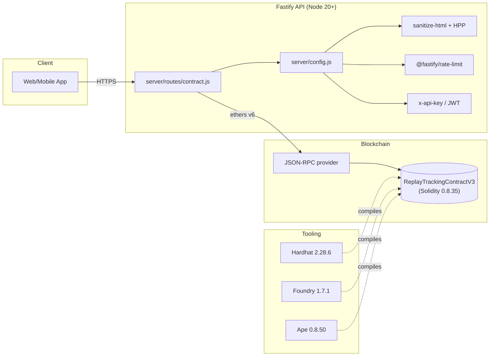

# Architecture

The replay-tracking system has three tiers:

## Request lifecycle

1. Client sends a request with `X-Api-Key` (or `Authorization: Bearer <jwt>`).
2. Fastify's `onRequest` hook validates the key (constant-time compare in prod).
3. The pre-handler hook runs HPP and `sanitize-html` on body / query / params.
4. JSON Schema validation rejects malformed payloads before they hit the handler.
5. The handler makes a single JSON-RPC call to the chain via ethers v6.
6. The result is `BigInt`-safe-serialized and returned.

## Failure modes

| Failure | Detection | Recovery |
|---|---|---|
| RPC unreachable | `provider.getBlockNumber()` in `/ready` | 503 from `/ready`; client retries |
| Rate limit exceeded | `@fastify/rate-limit` | 429 with `Retry-After` |
| Auth failure | `onRequest` hook | 401 |
| Schema violation | Fastify built-in | 400 with the validation error |
| Out-of-gas on chain | `tx.wait()` throws | 400 + log; admin retries with higher gas |
